# MVP – Pipeline de Dados para Análise da Evolução das Transações Pix no Brasil

## 1. Contexto de Negócio e Perguntas

O Pix é um sistema de pagamentos instantâneos desenvolvido pelo Banco Central e que passou a fazer parte do dia a dia de milhões de brasileiros.

Este projeto foi desenvolvido como MVP da disciplina de Engenharia de Dados, utilizando dados públicos disponibilizados pelo Banco Central sobre as transações Pix.

O objetivo do projeto é construir um pipeline de dados em nuvem para armazenar, tratar e analisar os dados das transações Pix, buscando entender como a utilização desse meio de pagamento evoluiu ao longo do período analisado.

Para o desenvolvimento do projeto foi utilizado o Databricks, seguindo a arquitetura Medallion, com as camadas Bronze, Silver e Gold. As transformações e análises foram realizadas utilizando SQL.

### 1.1 Perguntas de Negócio

Para seguir com as análises, foram definidas cinco perguntas:

1. Como evoluiu a quantidade de transações Pix ao longo do período analisado?
2. Como evoluiu o volume financeiro movimentado por meio do Pix?
3. Como evoluiu o valor médio das transações?
4. Quais naturezas de transação possuem maior participação?
5. Como o volume financeiro das transações Pix difere entre pessoas físicas e pessoas jurídicas?


## 2. Carga dos Dados

Os dados utilizados neste projeto são públicos e foram disponibilizados pelo Banco Central, por meio do conjunto de dados Estatísticas do Pix.

Foi utilizado os dados de Estatísticas de transações Pix, que possui informações mensais sobre quantidade e volume financeiro das transações, além de outras características disponíveis na base.

O arquivo foi baixado no formato CSV pelo portal de dados abertos do Banco Central.

Neste projeto, a coleta foi realizada de forma manual. Após o download, o arquivo CSV foi carregado em um Volume do Databricks.

O arquivo foi armazenado no seguinte local:

`/Volumes/workspace/default/pix_raw/`

A partir desse arquivo foi iniciado o pipeline de dados.

**Fonte dos dados:** Banco Central do Brasil – Estatísticas do Pix.

### Evidência do armazenamento dos dados

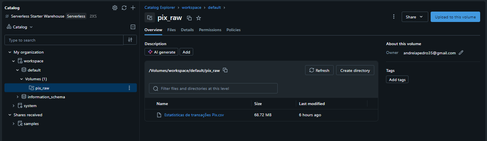

**Figura 1 – Arquivo CSV armazenado no Volume do Databricks.**  


## 3. Arquitetura do Pipeline

O pipeline foi desenvolvido seguindo a arquitetura Medallion, organizando os dados em diferentes camadas de acordo com o nível de tratamento.

O fluxo utilizado no projeto foi:

**Banco Central → Arquivo CSV → Raw → Bronze → Silver → Gold → Análises**

Na camada Raw, o arquivo original foi armazenado no Volume do Databricks.

Na camada Bronze, os dados foram carregados mantendo uma estrutura próxima à fonte original.

Na camada Silver, foram realizadas verificações e tratamentos nos dados.

Na camada Gold, foram criadas tabelas agregadas para atender às necessidades das análises.

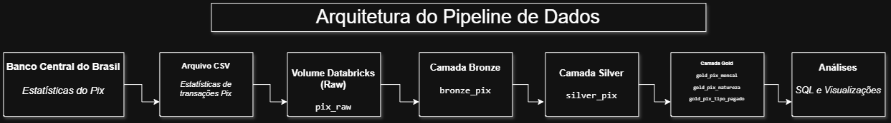

**Figura 2 – Arquitetura do pipeline de dados.**  


## 4. Modelagem e Catálogo de Dados

A modelagem dos dados foi organizada seguindo as camadas Bronze, Silver e Gold da arquitetura Medallion.

Para o projeto foi adotada uma modelagem simples, baseada em tabelas flat e tabelas agregadas. A camada Silver mantém os dados tratados em uma tabela ampla e a camada Gold possui tabelas agregadas de acordo com as necessidades das perguntas de negócio.

Para apoiar a documentação do catálogo de dados, foram utilizadas consultas `DESCRIBE TABLE` no Databricks, permitindo verificar os nomes das colunas e seus respectivos tipos de dados.

Também foram realizadas consultas SQL para analisar os domínios dos campos categóricos e identificar os valores mínimo e máximo dos principais campos numéricos.

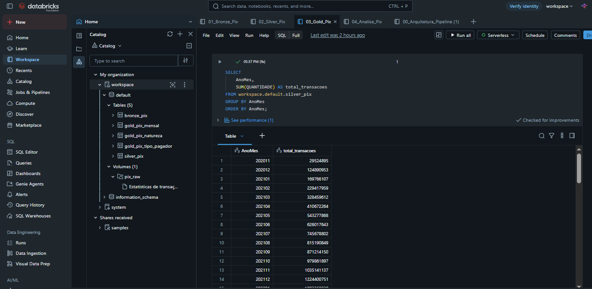

**Figura 3 – Tabelas das camadas Bronze, Silver e Gold armazenadas no Databricks.**  


### 4.1 Camada Bronze – `bronze_pix`

A camada Bronze contém os dados carregados a partir do arquivo CSV, mantendo a estrutura próxima ao arquivo de origem.

| Campo | Tipo | Descrição |
|---|---|---|
| AnoMes | INT | Ano e mês de referência dos dados |
| PAG_PFPJ | STRING | Tipo de pessoa do pagador |
| REC_PFPJ | STRING | Tipo de pessoa do recebedor |
| PAG_REGIAO | STRING | Região do pagador |
| REC_REGIAO | STRING | Região do recebedor |
| PAG_IDADE | STRING | Faixa etária do pagador |
| REC_IDADE | STRING | Faixa etária do recebedor |
| FORMAINICIACAO | STRING | Forma de iniciação da transação |
| NATUREZA | STRING | Natureza da transação |
| FINALIDADE | STRING | Finalidade da transação |
| VALOR | STRING | Volume financeiro recebido da fonte original |
| QUANTIDADE | INT | Quantidade de transações correspondente ao registro |
| _rescued_data | STRING | Campo técnico gerado durante a leitura dos dados |

A tabela Bronze possui **741.383 registros**, referentes ao período de **novembro de 2020 a agosto de 2026**.

Os campos categóricos da camada Bronze mantêm os valores recebidos da fonte original. Os domínios foram analisados e documentados de forma mais detalhada na camada Silver, após as verificações de qualidade.


### 4.2 Camada Silver – `silver_pix`

Na camada Silver os dados foram preparados para utilização nas análises.

O principal tratamento realizado foi a conversão do campo `VALOR`, que estava armazenado como texto na camada Bronze e passou para o tipo `DECIMAL(18,2)`.

O campo técnico `_rescued_data` também não foi mantido nessa camada.

| Campo | Tipo | Descrição | Domínio / valores observados |
|---|---|---|---|
| AnoMes | INT | Ano e mês de referência dos dados | 202011 a 202608 |
| PAG_PFPJ | STRING | Tipo de pessoa do pagador | PF, PJ, Nao disponivel |
| REC_PFPJ | STRING | Tipo de pessoa do recebedor | PF, PJ, Nao disponivel |
| PAG_REGIAO | STRING | Região do pagador | CENTRO-OESTE, NORDESTE, NORTE, SUDESTE, SUL, Nao informado |
| REC_REGIAO | STRING | Região do recebedor | CENTRO-OESTE, NORDESTE, NORTE, SUDESTE, SUL, Nao informado |
| PAG_IDADE | STRING | Faixa etária do pagador | Faixas etárias, Nao informado, Nao se aplica e `"null"` (texto) |
| REC_IDADE | STRING | Faixa etária do recebedor | Faixas etárias, Nao informado, Nao se aplica e `"null"` (texto) |
| FORMAINICIACAO | STRING | Forma de iniciação da transação | APDN, APES, AUTO, DICT, INIC, MANU, QRDN, QRES, Nao disponivel e `"null"` (texto) |
| NATUREZA | STRING | Natureza da transação | B2B, B2G, B2P, G2B, G2G, G2P, P2B, P2G, P2P, Nao disponivel |
| FINALIDADE | STRING | Finalidade da transação | Pix, Pix Saque, Pix Troco, Nao disponivel |
| VALOR | DECIMAL(18,2) | Volume financeiro correspondente ao registro | R$ 0,01 a R$ 726.543.194.521,15 |
| QUANTIDADE | INT | Quantidade de transações correspondente ao registro | 1 a 264.542.871 |

A tabela Silver permaneceu com **741.383 registros** após os tratamentos.

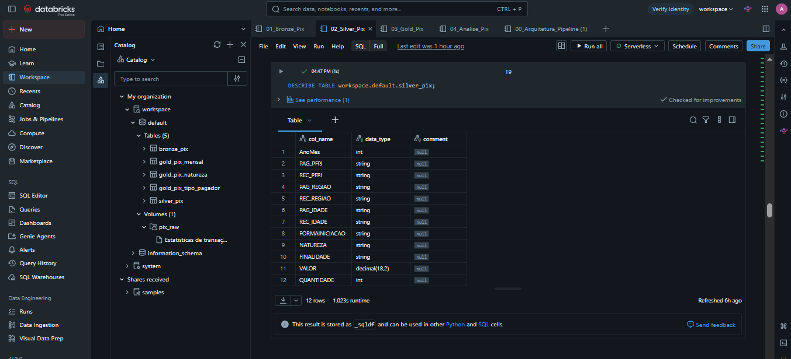

**Figura 4 – Estrutura e tipos de dados da tabela `silver_pix` consultados no Databricks.**  


### 4.3 Camada Gold

A camada Gold foi criada a partir da tabela `silver_pix` e contém dados agregados e preparados para responder às perguntas de negócio.

Foram criadas três tabelas.

#### `gold_pix_mensal`

Essa tabela apresenta os principais indicadores do Pix agrupados por mês.

| Campo | Tipo | Descrição | Domínio |
|---|---|---|---|
| AnoMes | INT | Ano e mês de referência | 202011 a 202608 |
| total_transacoes | BIGINT | Quantidade total de transações no mês | Valor numérico maior ou igual a 0 |
| volume_financeiro | DECIMAL(28,2) | Volume financeiro total no mês | Valor monetário maior ou igual a 0 |
| valor_medio | DECIMAL(29,2) | Valor médio das transações no mês | Valor monetário maior ou igual a 0 |

A tabela possui **70 registros**, correspondentes aos meses entre novembro de 2020 e agosto de 2026.

#### `gold_pix_natureza`

Essa tabela apresenta os indicadores agrupados pela natureza das transações Pix.

| Campo | Tipo | Descrição | Domínio |
|---|---|---|---|
| NATUREZA | STRING | Natureza da transação | B2B, B2G, B2P, G2B, G2G, G2P, P2B, P2G, P2P, Nao disponivel |
| total_transacoes | BIGINT | Quantidade total de transações | Valor numérico maior ou igual a 0 |
| volume_financeiro | DECIMAL(28,2) | Volume financeiro total | Valor monetário maior ou igual a 0 |
| valor_medio | DECIMAL(29,2) | Valor médio das transações | Valor monetário maior ou igual a 0 |

A tabela possui **10 registros**, correspondentes às diferentes naturezas existentes na base.

#### `gold_pix_tipo_pagador`

Essa tabela apresenta os indicadores agrupados pelo tipo de pagador.

| Campo | Tipo | Descrição | Domínio |
|---|---|---|---|
| tipo_pagador | STRING | Tipo de pessoa do pagador | PF, PJ, Nao disponivel |
| total_transacoes | BIGINT | Quantidade total de transações | Valor numérico maior ou igual a 0 |
| volume_financeiro | DECIMAL(28,2) | Volume financeiro total | Valor monetário maior ou igual a 0 |
| valor_medio | DECIMAL(29,2) | Valor médio das transações | Valor monetário maior ou igual a 0 |

A tabela possui **3 registros**, correspondentes aos tipos de pagador existentes na base.


### 4.4 Linhagem dos Dados

A linhagem dos dados utilizada no projeto segue o fluxo:

`Arquivo CSV → bronze_pix → silver_pix → tabelas Gold → análises`

A tabela `bronze_pix` foi criada a partir do arquivo CSV armazenado no Volume do Databricks.

A tabela `silver_pix` foi criada a partir da Bronze, após as verificações de qualidade e os tratamentos realizados.

As tabelas `gold_pix_mensal`, `gold_pix_natureza` e `gold_pix_tipo_pagador` foram criadas a partir da Silver por meio de agregações utilizadas nas análises.

As análises finais foram realizadas utilizando as tabelas da camada Gold.


## 5. Pipeline de Dados

O desenvolvimento do pipeline foi dividido em quatro notebooks.

### `01_Bronze_Pix`

Responsável pela leitura do arquivo CSV armazenado no Volume e pela criação da tabela `bronze_pix`.

A camada Bronze possui 741.383 registros e compreende o período entre novembro de 2020 e agosto de 2026.

**Código:** [01_Bronze_Pix.sql](notebooks/01_Bronze_Pix.sql)


### `02_Silver_Pix`

Responsável pelas verificações de qualidade e pelo tratamento dos dados.

Nesta etapa foram realizadas verificações de valores nulos, duplicidades, categorias dos campos, domínios e tipos de dados.

O campo `VALOR` foi convertido de `STRING` para `DECIMAL(18,2)` após a validação dos valores.

**Código:** [02_Silver_Pix.sql](notebooks/02_Silver_Pix.sql)


### `03_Gold_Pix`

Responsável pela criação das tabelas agregadas utilizadas nas análises:

- `gold_pix_mensal`
- `gold_pix_natureza`
- `gold_pix_tipo_pagador`

**Código:** [03_Gold_Pix.sql](notebooks/03_Gold_Pix.sql)


### `04_Analise_Pix`

Responsável pelas consultas SQL utilizadas para responder às perguntas de negócio e pela criação das visualizações dos resultados.

**Código:** [04_Analise_Pix.sql](notebooks/04_Analise_Pix.sql)


## 6. Qualidade de Dados

Antes da criação da camada Silver, foram realizadas verificações para entender a qualidade dos dados e identificar possíveis problemas na base.

As verificações buscaram avaliar a completude, consistência e unicidade dos dados, além de observar os domínios dos campos e possíveis valores extremos que pudessem afetar as análises.

A base possui **741.383 registros**. Foram verificados valores nulos, registros duplicados, tipos de dados e categorias existentes nos campos.

Nas verificações realizadas, não foram encontrados valores SQL `NULL` nos campos analisados.

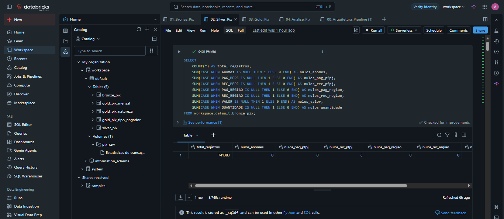

**Figura 5 – Verificação de valores nulos nos dados da camada Bronze.**  


Também não foram identificadas duplicidades completas na base. A comparação entre a quantidade total de registros e a quantidade de registros distintos apresentou **741.383 registros nos dois casos**.

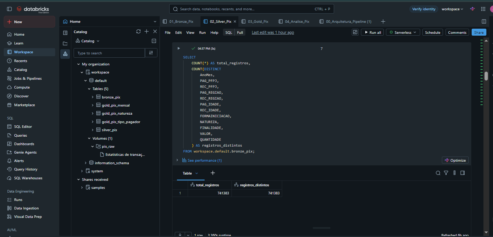

**Figura 6 – Verificação de registros duplicados na base de dados.**  


Durante uma verificação complementar, foram encontrados registros contendo o texto `"null"` nos campos `PAG_IDADE`, `REC_IDADE` e `FORMAINICIACAO`.

Foram identificadas **12.860 ocorrências em `PAG_IDADE`**, **11.980 em `REC_IDADE`** e **1.952 em `FORMAINICIACAO`**.

Esses valores foram mantidos, pois esses campos não são utilizados nas análises definidas para este prpjeto e a remoção dos registros poderia causar perda de outras informações.

Também foram encontradas categorias como `Nao informado`, `Nao disponivel` e `Nao se aplica`. Essas categorias foram mantidas por fazerem parte dos dados de origem.

Outro ponto identificado foi o campo `VALOR`, que estava armazenado como texto na camada Bronze. Antes da conversão, foi realizada uma validação com `TRY_CAST` e não foram encontrados valores inválidos.

Após a validação, o campo `VALOR` foi convertido para `DECIMAL(18,2)` na camada Silver, permitindo a realização dos cálculos das análises.

O campo técnico `_rescued_data` não foi mantido na camada Silver por não ser necessário para as análises.

Após os tratamentos, a tabela `silver_pix` permaneceu com os mesmos **741.383 registros** da camada Bronze.


## 7. Análise de Dados

Após a construção das camadas Bronze, Silver e Gold, foram realizadas consultas SQL para responder às cinco perguntas definidas no início do projeto.


### 7.1 Como evoluiu a quantidade de transações Pix ao longo do período analisado?

A análise mostra um crescimento expressivo na quantidade de transações Pix entre novembro de 2020 e agosto de 2026.

Apesar de algumas oscilações mensais, a tendência geral é de crescimento ao longo do período.

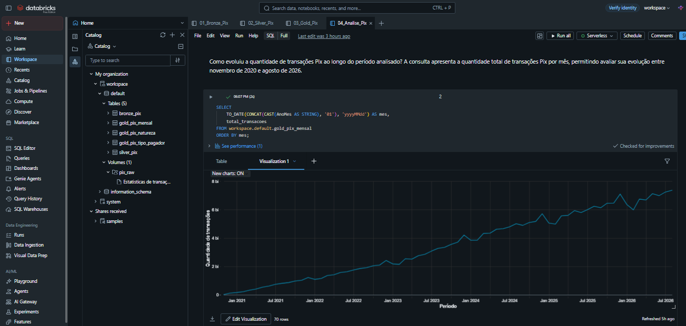

**Figura 7 – Evolução da quantidade de transações Pix.**  


### 7.2 Como evoluiu o volume financeiro movimentado por meio do Pix?

O volume financeiro movimentado pelo Pix também apresentou crescimento significativo ao longo do período analisado.

Apesar de algumas oscilações entre os meses, é possível observar uma tendência de crescimento no valor movimentado.

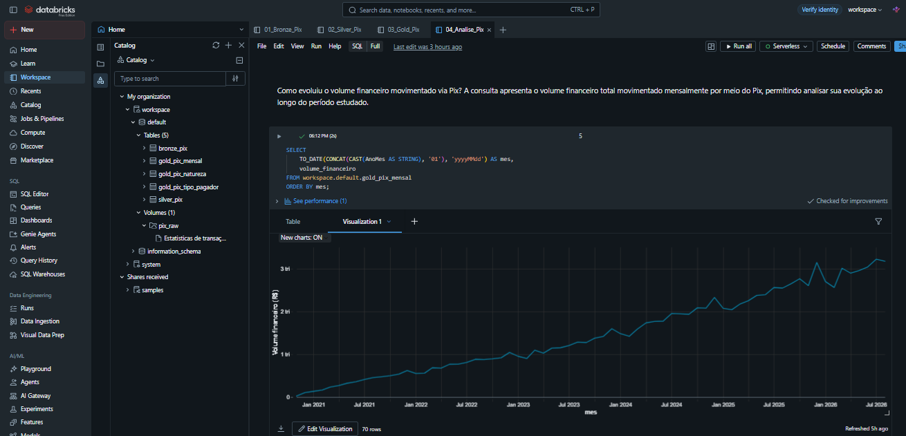

**Figura 8 – Evolução do volume financeiro movimentado por meio do Pix.**  


### 7.3 Como evoluiu o valor médio das transações?

No início do período analisado, o valor médio das transações era de aproximadamente **R$ 876**.

Ao longo do tempo, esse valor apresentou redução e posteriormente passou a apresentar maior estabilidade, permanecendo próximo de **R$ 400** nos períodos mais recentes.

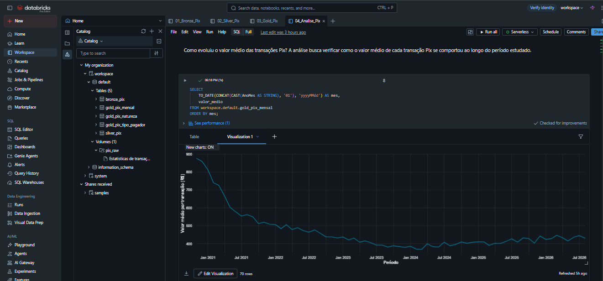

**Figura 9 – Evolução do valor médio das transações Pix.**  


### 7.4 Quais naturezas de transação possuem maior participação?

As transações **P2P (pessoa para pessoa)** apresentaram a maior quantidade de operações, com aproximadamente **121,66 bilhões de transações**.

Em seguida aparecem as transações **P2B (pessoa para empresa)**, com aproximadamente **94,74 bilhões de transações**.


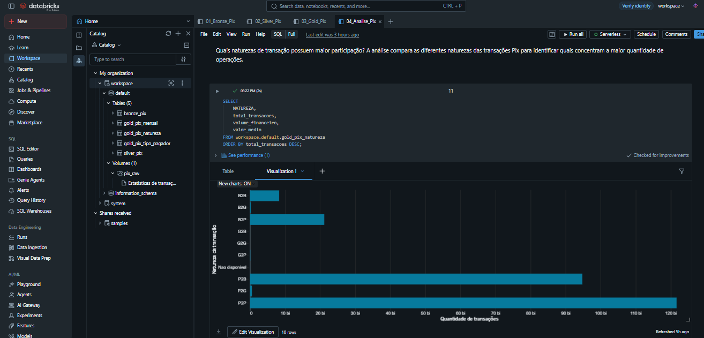

**Figura 10 – Quantidade de transações Pix por natureza.**  


### 7.5 Como o volume financeiro das transações Pix difere entre pessoas físicas e pessoas jurídicas?

Apesar de as pessoas físicas realizarem uma quantidade maior de transações, as pessoas jurídicas apresentaram maior volume financeiro movimentado.

As pessoas jurídicas movimentaram aproximadamente **R$ 60,13 trilhões**, enquanto as pessoas físicas movimentaram aproximadamente **R$ 43,77 trilhões** durante o período analisado.

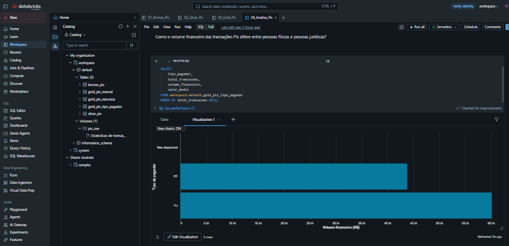

**Figura 11 – Volume financeiro das transações Pix por tipo de pagador.**  


### 7.6 Conclusão das Análises

De forma geral, os resultados mostram um crescimento expressivo da utilização do Pix ao longo do período analisado, tanto na quantidade de transações quanto no volume financeiro movimentado.

As transações P2P e P2B apresentaram as maiores quantidades de operações, mostrando a forte utilização do Pix nas transferências entre pessoas e nos pagamentos realizados para empresas.

Também foi possível observar que, apesar da grande quantidade de operações realizadas por pessoas físicas, as pessoas jurídicas apresentaram o maior volume financeiro movimentado.

Com as análises realizadas, foi possível responder às perguntas definidas no início do projeto e entender melhor a evolução e algumas das principais características das transações Pix no Brasil.


## 8. Autoavaliação

Esse projeto foi uma experiência muito importante para o meu aprendizado, principalmente por ser meu primeiro projeto de Engenharia de Dados.

No início tive algumas dificuldades para entender como organizar e desenvolver todas as etapas, mas ao longo do trabalho fui conseguindo compreender melhor o processo e colocar em prática os conhecimentos adquiridos durante a disciplina.

Acredito que consegui atingir o objetivo proposto, construindo um pipeline completo desde a coleta e armazenamento dos dados até o tratamento, organização e análise das informações.

Durante o desenvolvimento também encontrei alguns desafios, principalmente no tratamento dos dados e na criação das análises, mas conseguir identificar e corrigir esses pontos fez parte do meu aprendizado.

Fiquei muito satisfeita com o resultado final e principalmente com o quanto aprendi durante o desenvolvimento.

Sei que o projeto ainda pode ser aprimorado, como com a automatização da coleta dos dados e a inclusão de novas análises, mas acredito que, para um primeiro projeto na área, consegui aplicar de forma prática os principais conceitos estudados e entender melhor como funciona um projeto de Engenharia de Dados de ponta a ponta.


## 9. Tecnologias Utilizadas

- Databricks
- SQL
- Delta Lake
- Arquitetura Medallion
- Banco Central do Brasil – Dados Abertos


## 10. Estrutura do Projeto

```text
mvp-pipeline-pix/
│
├── README.md
│
├── notebooks/
│   ├── 01_Bronze_Pix.sql
│   ├── 02_Silver_Pix.sql
│   ├── 03_Gold_Pix.sql
│   └── 04_Analise_Pix.sql
│
└── imagens/
    ├── 01_volume_pix_raw.png
    ├── 02_arquitetura_pipeline.png
    ├── 03_tabelas_catalog_databricks.png
    ├── 04_describe_silver.png
    ├── 05_verificacao_nulos.png
    ├── 06_verificacao_duplicidades.png
    ├── 07_evolucao_quantidade_pix.png
    ├── 08_evolucao_volume_financeiro.png
    ├── 09_evolucao_valor_medio.png
    ├── 10_transacoes_por_natureza.png
    └── 11_volume_pf_pj.png
```

Os notebooks foram organizados de acordo com as etapas do pipeline e a pasta `imagens` contém as evidências e visualizações utilizadas nesta documentação.
